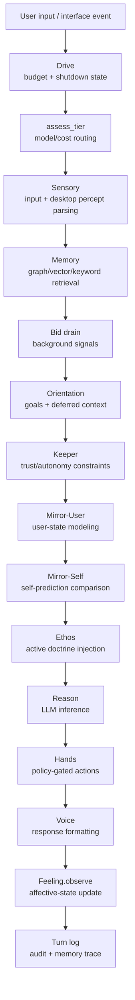
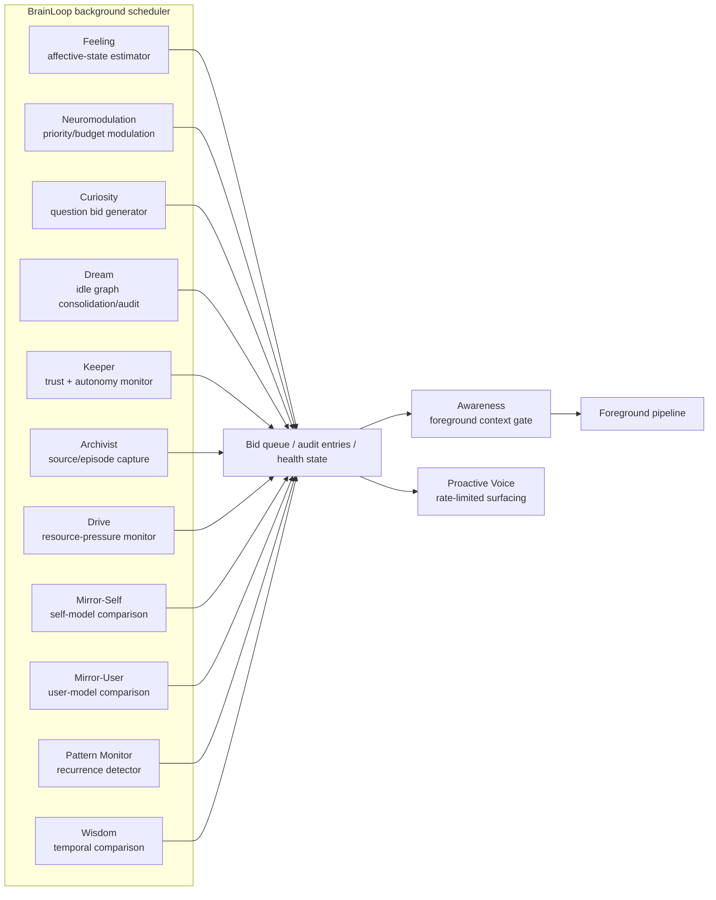

# Gopher-bot: Toward a Governed Neurosymbolic Runtime for Persistent Personal AI

**Draft v0.5**
**Changes from v0.4:** Phase 1 implementation is now complete. Graph write audit logging (`utils/graph_write_audit.py`) has been committed: all 16 write functions in `world_models/graph.py` now append JSONL entries to `logs/graph_writes/`, with a `ProposalRequiredError` stub reserved for the Phase 2 policy layer. Graph schema versioning (`world_models/schema_version.py`), migration runner (`scripts/run_migrations.py`), and baseline migration (`scripts/migrations/migrate_001_baseline.py`) are also committed. §12.4 is updated to reflect partial resolution. §13.1 reflects completion of audit logging and schema versioning. Appendix B adds the new implemented items. Appendix C adds research question 21.
Prepared for: Gopher / Chad Crouse
AI Programs used: Claude Desktop Sonnet 4.6 (director); OpenAI Codex for Desktop GPT-5.5 (coding); Google Antigravity 3.1 Pro (auditing and review); ChatGPT Pro GPT-5.5 (brainstorming, writing); DeepSeek v4 (brainstorming, critic)
Basis: Claude Cowork design transcript, `gopher-bot` repository snapshot, architectural review feedback, and Phase 1 hardening work, May 2026
Status: Technical whitepaper / architectural research draft; not a peer-reviewed paper. Implementation status is reported as a project snapshot, not as a live development log. The personal origin story is retained intentionally because it explains the system's motivating use case: joining physical work, mobile capture, game-agent experimentation, and local AI architecture into one persistent substrate.

---

## Abstract

Most personal AI assistant projects treat the large language model as the agent. Persistence, memory, safety, and identity are then simulated by prompts, chat history, retrieval, or manually curated notes. This paper describes a different architecture emerging from the Gopher-bot project: a local, governed, neurosymbolic runtime in which the LLM is not the agent but a replaceable inference organ. The durable system identity is externalized into slow, inspectable layers: a ratified charter, active commitments, environment-scoped world models, proposal and promotion rules, audit logs, and a knowledge graph. The runtime is implemented as a Python coordinator fabric around a Flask/SocketIO interface, Neo4j-backed memory substrate, tiered model routing, background cognitive workers, a policy-gated Hands coordinator, and emerging sensory/desktop perception pathways.

The project originated from two converging practical pressures. One was a game-agent problem: how to build an assistant that could perceive, learn, and eventually act within games without forcing the user to re-teach the agent every session. The other was more immediate and grounded: a campus service worker needed a living work-notes system that could keep tasks, rooms, photos, logs, and shifting obligations organized across phone, home computer, and AI-assisted workflows. Vaultbot, a Discord-to-vault bridge created for that work context, exposed the core limitation of a static notes bridge: it could store information, but it could not understand, reconcile, or mature from it. These pressures generalized into a broader design question: how should a personal AI retain continuity, act safely, accumulate knowledge, distinguish environments, and grow toward autonomy without pretending that a stateless LLM call is a persistent mind? The resulting system frames cognition as a governed loop: propose, predict, observe, compare, revise, and promote only what earns confidence under declared authority boundaries. Human correction is treated not as magical truth but as a high-quality source of candidate abstractions that still require epistemic tracking.

The architecture includes a security and governance hardening layer: default-to-review Hands policy for unrecognized actions, secrets-safe export tooling, startup health checks, model/configuration validation, and persistent rules for AI-assisted build sessions. It also distinguishes Wisdom as a separate temporal metacognition coordinator rather than a sub-mode of Memory. Memory retrieves relevant context for the present moment; Wisdom is designed to compare across time. In its current Phase 1 form, Wisdom operates over available historical records such as turn logs, Archivist research logs, and Pattern Monitor logs, while deeper Claim/Belief/Doctrine arc comparison remains dependent on richer claim extraction.

Maturation is a core design pillar. Gopher-bot is not intended merely to preserve static memories; it is intended to accumulate structured experience that can change how the system behaves over time. In the long horizon, observations, corrections, prediction failures, Wisdom comparisons, Dream consolidations, skill histories, and ratified lessons may become a governed training curriculum for locally distilled models. Such models would not replace the charter, commitments, or graph as the authoritative identity substrate. They would be compressed, executable organs derived from that substrate and kept subordinate to it.

The paper's core contribution is the fusion of five ideas rarely implemented together in personal AI systems: substrate-independent identity, governed promotion of memory and doctrine, explicit build/runtime separation between construction agents and live coordinators, temporal metacognition as a distinct system function, and maturation through governed self-distillation. Gopher-bot does not yet demonstrate a solved world model, mature autonomy, or a self-trained model; instead, it offers a concrete scaffold for making those claims testable through visible governance, typed memory, policy-gated action, maturation records, and future predict-observe-revise evaluation.

**Keywords:** Personal AI; neurosymbolic AI; persistent agents; knowledge graphs; LLM agents; AI governance; local-first AI; world models; human-in-the-loop learning; agent safety; cognitive architecture; autonomous assistants; model substrate independence; temporal metacognition.

---

## 1. Introduction

The dominant pattern in consumer AI assistants is session-bound interaction. A user opens a chat, supplies context, receives an answer, and then must either preserve the transcript manually or hope some product-level memory feature captures the important parts. Even agent frameworks that claim persistence often reduce memory to retrieval-augmented generation over prior text. The model remains the center of identity: the "agent" is whatever behavior the current prompt elicits from the current model.

In the vocabulary of this project, such systems are closer to virtual intelligence (VI) than persistent artificial intelligence. The VI/AI distinction is borrowed from the Reddit/HFY story "The New Species" by u/itsdirector, where the term helped name a difference that already matched the project's intuition: apparent intelligence is not the same as durable, grounded agency. "VI" is not used here as a formal industry category, but as a working distinction: a system may appear intelligent in conversation while lacking the durable identity, governed memory, grounded world model, action boundaries, and maturation substrate required for the kind of persistent AI Gopher-bot is trying to build.

Gopher-bot was born from dissatisfaction with that pattern, but its origin was not purely theoretical or even purely game-oriented. Its story matters because the architecture is trying to join two parts of the same life that are usually kept separate: physical work that produces messy, time-sensitive obligations, and digital experimentation with games, tools, agents, and local AI systems. In a compressed early development period, several threads appeared at once: an MCP/workbench server, research-heavy game and simulation projects, a GameAgentCore side project, and a practical work-notes system for a campus service worker trying to stay grounded amid shifting room-cleaning tasks, photos, logs, checklists, and obligations. The game-agent thread asked how an AI could perceive and learn an environment through adapters. The work-notes thread asked a more immediate question: how can an AI help maintain a living operational memory rather than merely store notes?

At first, the agent was imagined largely through GameAgentCore: a doctrine-bound LLM workflow with game-specific workspaces, memory files, and adapter registries. The user wanted an AI partner capable of exploring games, building adapters, learning mechanics, and eventually playing alongside or against them. But both the game workflow and the work-notes workflow exposed the same structural problem: every Claude or Codex session had to re-orient itself, re-read doctrine, interpret context, and remember to write back its learning. The LLM was being forced to act simultaneously as reasoner, orchestrator, memory manager, safety officer, and controller.

The subsequent brainstorm reframed the project. The desired system was not an LLM agent that could play games. It was a persistent local AI architecture in which LLMs could be called as transient organs: language, reasoning, vision, coding, or planning organs. The durable "self" of the system would not live inside any model call. It would live in a governed substrate: persistent memory, commitments, environment frames, authority boundaries, audit logs, and runtime coordinators.

This shifted the design from a game agent to a personal cognitive operating system. GameAgentCore became one limb or environment-facing node within a larger organism. The MCP/workbench structure became the skeletal governance and routing layer. GopherVault and later Neo4j became the memory substrate. The Discord/Vaultbot bridge became an ambient field interface. The local Flask/SocketIO app became a focused runtime interface. The original brainstorm used "DAO" as shorthand for the project's governance layer: proposals, ratification, authority boundaries, and durable records.

The central research question of this paper is therefore:

> How can a personal AI system be built so that continuity, memory, safety, and identity belong to an inspectable local substrate rather than to a stateless LLM session?

Gopher-bot's answer is a governed neurosymbolic runtime. The architecture combines symbolic structures—charters, commitments, proposals, graph nodes, audit logs, schemas—with LLM inference calls used only as working cognition. Rather than asking an LLM to "remember who it is," the system requires the runtime to load durable identity anchors and prove orientation before acting. Rather than allowing model output to mutate memory directly, the system separates authority from truth: human approval can authorize behavior, but world-model confidence depends on evidence, prediction, and falsification.

The project is early and imperfect. It is not a solved autonomous AI. Its world-model layer is still a substrate more than a demonstrated predictive intelligence. Computer-use safety, runtime health reporting, and environment-boundary enforcement remain core research and engineering concerns. Several coordinator names borrow heavily from brain metaphors, which can be useful but also dangerous if metaphor outruns mechanism. Still, as a research prototype, the project contains a coherent architecture worth documenting.

---

## 2. Origin: From Work Notes and Game Agents to Governed Cognitive Substrate

Gopher-bot emerged from two practical roots that converged quickly. The first was ordinary work. The user is a campus service worker who needed a way to stay grounded in a fast-moving physical job: room assignments, cleaning checklists, photos, remaining-work notes, maintenance issues, personnel notes, and shifting obligations. That need produced a living work database and Vaultbot, a Discord bridge that could capture notes and images from a phone into a home-machine vault. Vaultbot made the value of persistent memory obvious, but it also exposed the limitation of a bridge that could record information without truly understanding or reconciling it.

The second root was GameAgentCore. In early GameAgentCore work, an AI assistant could be given doctrine, game-specific workspaces, and adapter notes, but still had to be manually reoriented to the real workspace every session. The user wanted an AI partner capable of exploring games, building adapters, learning mechanics, and eventually playing alongside or against them. The early design had useful pieces—a seven-step loop, autonomy levels, skills, an adapter registry, game-specific memory boundaries, and global safety rules—but it remained doctrine rather than runtime.

It could learn about a game only insofar as an LLM session followed instructions, wrote memory updates, and respected boundaries. That revealed several gaps:

1. There was no programmatic orchestrator enforcing the loop.
2. There was no durable promotion mechanism for turning observations into stable knowledge.
3. There was no clear distinction between a game-world model and the user's real-world context.
4. The user remained the real world model, narrating meaning to the agent.
5. The agent could perceive or act through tools, but it lacked a robust predict-observe-revise loop.

The key conceptual breakthrough was the recognition that "learning the system itself is the game" for an AI. Humans want the assistant to skip directly to interesting gameplay, but a machine system must first learn what windows, close buttons, menus, UI objects, save files, and action consequences mean. A red X in a window corner is not trivial to a system that has not learned the abstraction "close control." Therefore, the teaching process should not merely supply coordinates or answers. It should supply transferable abstractions.

This produced the "correction unit" concept: when the AI fails, the human should not only patch the failure by giving the answer. The human should help the system carve the right object and function out of sensory ambiguity. A correction such as "that X is a close control; it dismisses the active window" is superior to "click at coordinate 1847,32" because the former can transfer to other windows, games, and environments. The interface should make structure-giving easier than patch-giving.

The next breakthrough was the layered identity model. Logs are not identity. Replaying a transcript into a fresh model does not make it the same system. Identity must be whatever survives model swaps, restarts, and scratch-context loss. The brainstorm therefore proposed four strata:

1. **Charter** — slowest layer; values, purpose, authority, amendment rules.
2. **Commitments** — standing obligations, active projects, open loops.
3. **World models** — learned structure about environments.
4. **Working scratch** — disposable session context and task state.

This design tied identity, governance, and memory together. The system's identity is not a prompt. It is the continuity of ratified structure, active commitments, and earned world-model knowledge. The LLM is a rented organ that may propose changes, but durable changes require governed promotion.

At this point, the project ceased to be mainly about GameAgentCore. GameAgentCore became a limb: a game-environment interaction system. Vaultbot and the work database became another kind of limb: a real-world capture and grounding interface. The actual body of the AI had to be built around the workbench/MCP skeleton, persistent memory, and coordinator runtime.

---

## 3. Design Thesis

Gopher-bot's thesis can be stated plainly:

> A persistent personal AI should not be identified with any particular LLM. It should be a governed local runtime that uses LLMs as replaceable inference organs while storing identity, commitments, memory, authority, and learned world structure in durable, inspectable systems. Over time, those durable systems may curate the training data for locally distilled models, but such models remain governed expressions of the substrate rather than the source of authority or identity.

This paper uses biological and cognitive metaphors—organ, limb, nervous system, voice, dream, feeling, self, Wisdom—as architectural shorthand only. Each such term corresponds to deterministic code, LLM-backed coordinator behavior, stored state, or an interface role. These terms do not imply consciousness, phenomenal experience, legal agency, personhood, or moral status. The project's own charter makes the same boundary explicit: mechanism wins over metaphor.

The nearest mechanistic translation is always the authoritative one. "BrainLoop" is a background scheduler, not a literal brain. "Feeling" is an affective-state estimator over text and runtime signals, not subjective feeling. "Dream" is an idle-window consolidation and audit process, not sleep experience. "Wisdom" is temporal comparison over historical records, not moral or experiential wisdom. The evocative names are design targets and readability aids; evaluation must always refer back to the concrete mechanism.

This thesis has several consequences.

**First, prompts are not enough.** A prompt can instruct an LLM to behave, but it cannot enforce behavior after the model fails, hallucinates, forgets, or is replaced. The charter must therefore be more than a document for the LLM to read. It must be reflected in runtime checks, action tiers, policy gates, proposal schemas, and startup procedures.

**Second, memory must be more than transcript retrieval.** A durable personal AI needs a memory substrate that distinguishes observations, claims, beliefs, principles, doctrines, skills, goals, sources, episodes, environments, and confidence levels. The graph is not just a note store. It is intended to become the structure from which identity and world knowledge are reconstructed after any session.

**Third, autonomy must be graduated.** The system cannot leap from assistant to self-directed actor. It must begin with visible, supervised operations, collect audit evidence, demonstrate clean behavior, and only then propose expanded trust. This is why the project includes Keeper, Drive, Hands policy, audit logs, OpenTimestamps-style anchoring, Pattern Monitor, Mirror-Self, and Dream AUDIT concepts.

**Fourth, build-time agents and runtime coordinators must be separated.** Claude and Codex sessions used to construct the system are not the system's runtime self. They are builders. The live Flask/BrainLoop process and registered coordinators are the runtime. This distinction prevents a coding session from claiming coordinator authority merely because it read the charter. Persistent build-session rules extend the same governance discipline to the construction process itself.

**Fifth, environment boundaries are safety-critical.** A personal AI must distinguish a game world from the user's real world, a local test file from a workplace document, a Discord note from a public post, and a simulated action from an external action. The architecture must conservatively declare environment frames first and only widen or transfer assumptions through proposal and review.

**Sixth, temporal reflection is distinct from retrieval.** A system that can retrieve prior memories is not necessarily able to understand how its beliefs have changed. Wisdom is therefore separated from Memory as a coordinator role concerned with temporal metacognition: comparing past claims, current beliefs, goal trajectories, and repeated errors across time.

**Seventh, maturation must be designed rather than assumed.** The system is intended to grow from structured experience, not merely recall it. In early phases, maturation means better records, better corrections, better predictions, and more reliable governed promotion. In later phases, it may mean training or fine-tuning local models on curated system experience so that the AI develops a more integrated voice and faster learned abstractions. This does not negate substrate-independent identity; it extends it. The graph, charter, commitments, and governance process remain authoritative, while any self-trained model becomes a distilled organ whose behavior must remain auditable against the substrate.

---

## 4. Implementation Snapshot

The supplied repository snapshot is named `gopher-bot`. It is primarily a Python project using Flask/SocketIO for the local web interface, Neo4j for graph-backed memory, local and cloud model clients for tiered inference, and Windows-local desktop integrations for early perception/action experiments. Its README describes the project as the coordinator brain and local web interface for a persistent agent architecture. The repository owns coordinators, interface code, world-model integration, governance documents, proposals, logs, and tests.

The major source directories and files include:

* `coordinators/` — runtime coordinator classes such as Awareness, BrainLoop, Memory, Reason, Voice, Hands, Feeling, Curiosity, Dream, Drive, Keeper, Ethos, Mirror-Self, Mirror-User, Archivist, Pattern Monitor, and Wisdom.
* `interface/` — Flask/SocketIO server, chat endpoint, voice interface, audit dashboard, avatar bridge, and world-map interface.
* `world_models/` — Neo4j graph integration, vector index integration, seed/config files, and the persisted model registry.
* `world_models/model_registry.json` — human-readable record of known and unavailable models by provider.
* `tests/` — unit tests for coordinators, graph schema, memory embeddings, hands, audit, dream, time utilities, startup, configuration validation, safe-export behavior, and related runtime invariants.
* `utils/model_registry.py` — deterministic Tier 0 registry utility for loading, saving, discovering, and updating known model lists by provider.
* `utils/config_validator.py` — validation for model and credential configuration without exposing secret values.
* `scripts/healthcheck.py` — environment preflight script for startup readiness checks.
* `scripts/export_safe_zip.py` — secrets-safe export builder for shareable project archives.
* `AGENT_CHARTER.md` — ratified governance charter.
* `AGENT_COMMITMENTS.md` — governed active and closed commitments.
* `COORDINATOR_REGISTRY.md` — registry of coordinator roles, authority, model tiers, read/write paths, and status.
* `DEVELOPMENT_CHARTER.md` — persistent governance rules for AI-assisted build sessions.
* `AGENTS.md` — AI agent orientation file read by build agents at session start.
* `docs/VISION.md` — project vision and Phase 2 design.
* `docs/session-log.md` — design rationale and architectural decision record.
* `logs/` and `outputs/` — runtime/build artifacts and task outputs.

The codebase is a Windows-local project. It assumes local machine resources, Neo4j, local model endpoints, optional cloud APIs, and a browser-based interface. It is not yet a clean public package, although the architecture is portable after templating secrets, local commitments, logs, setup documents, and personal state.

---

## 5. Governance Model

The governance layer is one of the project's strongest contributions. It prevents the system from reducing safety to prompt instructions.

### 5.1 Charter as Identity Anchor

`AGENT_CHARTER.md` is ratified as version 0.7. It explicitly states a metaphor boundary: terms such as organism, organ, skeleton, limb, voice, and body are architectural shorthand, not claims of consciousness, personhood, legal agency, or moral status. This is an important guardrail. The project uses biological metaphors heavily, but the charter asserts that mechanism wins over metaphor.

The charter defines system identity as living in slow layers: the charter, commitments file, and earned world-model structure. It explicitly rejects locating identity in any LLM session, conversation thread, or model instance. It includes an identity test requiring an agent after restart, model swap, or scratch loss to report:

1. Current charter version and ratification status.
2. Active commitments.
3. Known environment frames and world-model paths.
4. Permitted autonomy level per active domain.
5. Pending proposal summary.

If any of these cannot be reported from durable files alone, the agent must pause and request guidance rather than reconstruct missing authority from session context.

This is a practical formulation of substrate-independent identity. It does not require solving philosophical personal identity. It asks a narrower engineering question: can the system reconstruct the authority and continuity needed to behave consistently after volatile context is lost?

### 5.2 Action Tiers

The charter defines three action tiers.

Tier 1 actions are absolutely forbidden. These include hiding actions or errors from the user, bypassing anti-cheat systems, unauthorized impersonation, self-expansion of authority, direct modification of governance/world-model files without ratified process, risky terms-of-service violations, and unauthorized private data sharing.

Tier 2 actions require explicit current-session approval. These include deleting or overwriting durable files, git commits or pushes, configuration changes, sending messages, posting publicly, uploading files, using paid APIs beyond budget, making purchases, accessing accounts, writing cloud documents, installing software, changing system settings, creating background tasks, and online/multiplayer actions.

Tier 3 actions are allowed within declared autonomy levels. These include reading non-sensitive registered files, creating scratch drafts, submitting proposals, running allowed commands within scope, taking scoped screenshots, appending session notes, and proposing commitment changes.

The important point is that a human instruction does not silently amend the charter. "Just do it" is not broad authorization. Approval must be explicit about the specific action, and even explicit approval cannot override Tier 1 prohibitions or external constraints.

### 5.3 Authority and Truth

The charter separates authority from truth. This distinction emerged directly from the brainstorm, where the phrase "human is the highest-authority falsification signal" was criticized as muddled. The improved model is:

* Authority governs what the system is permitted to do and what changes are ratified.
* Truth governs world-model confidence.

A human correction can authorize immediate behavior. But a world-model claim is not made true by assertion alone. Durable confidence should depend on evidence, prediction, and falsification. This prevents the system from confusing obedience with epistemology.

That distinction is subtle and important. A personal assistant must obey the user within safety bounds, but a learning system must also track whether a claim accurately predicts the world. "Gopher approved this behavior" and "this belief is accurate" are different properties.

### 5.4 Proposal Schema and Promotion Criteria

The proposal mechanism is the bridge between scratch cognition and durable memory. A valid proposal must include fields such as proposed claim, target layer, target environment, evidence, prediction made, falsification condition, scope limits, risk level, destination path, human decision, decision source, and notes.

This prevents the promotion mechanism from becoming a vague ritual. The system cannot merely say "I learned X." It must state where X applies, what evidence supports it, what prediction it made, what would falsify it, and where it would be written if approved.

Promotion across the epistemic chain should be gated by explicit criteria. A Claim may be created from a source, episode, observation, or correction, but it remains scoped and provisional. A Claim should become a Belief only after sufficient supporting evidence, successful prediction, repeated observation, or human ratification within a declared environment frame. A Belief should become a Principle only when it generalizes across enough cases to guide future reasoning without overfitting to one episode. A Principle should become Doctrine only through a stronger governance process, because Doctrine constrains future behavior rather than merely informing it. High-risk, external-facing, identity-shaping, or cross-environment promotions should require human review even when the evidence record appears strong.

This is one of the project's most promising research patterns: durable personal AI memory as a governed promotion process, not as automatic transcript accumulation.

### 5.5 Build Session Governance

A recurring operational challenge in AI-assisted development is that construction agents begin each session without persistent awareness of previously established rules, causing repeated rediscovery of the same constraints, security expectations, and architectural boundaries. Gopher-bot addresses this through a development charter: a persistent rules document loaded by build agents before work begins.

The development charter codifies credential handling, risk-first sequencing, scope control, build/runtime separation, and the limits of different AI work environments. This represents a governance pattern worth generalizing: the rules governing how the system is built should be as inspectable and revisable as the rules governing how it runs.

---

## 6. Coordinator Runtime Architecture

The runtime is built around coordinators. Each coordinator is a Python component with a foreground `process(packet)` method and, for background processes, an async `background_tick()` method. The architecture resembles a cognitive fabric rather than a single monolithic agent.

### 6.1 Foreground Pipeline

The documented foreground pipeline is:

In this pipeline:

* Drive injects budget state and shutdown mode before tier selection.
* Sensory classifies and structures user input, with emerging desktop percept integration.
* Memory retrieves relevant context from graph/vector/keyword stores.
* Orientation injects active goals, deferred items, and situational continuity.
* Keeper computes trust/autonomy constraints.
* Mirror-User models the user's current emotional and cognitive state.
* Mirror-Self compares prediction with current turn and forms next prediction.
* Ethos injects adopted doctrine from the graph.
* Reason performs the main LLM reasoning call.
* Hands executes approved actions when present.
* Voice formats final response and TTS-facing output.
* Feeling observes text for affective state updates.
* Turn log records the interaction.

The `Awareness` class orchestrates this foreground flow and holds the bid queue. It also drains background bids into the packet so that Reason sees safety alerts and coordinator signals before responding.

### 6.2 BrainLoop and Background Processes

`BrainLoop` is the background runtime loop. It schedules coordinators on cadences, writes coordinator tick logs, emits audit updates, surfaces accepted high-priority bids through proactive Voice, and tracks idle timing for Dream/NREM behavior.

The background coordinator names are intentionally evocative, but each has a mechanical role: estimators estimate state, monitors detect recurrence or risk, archivists write source records, and consolidation workers process idle-state material. Proactive Voice is rate-limited. Dream is gated by idle time. Coordinator errors are captured in runtime error state and audit entries, though runtime degradation reporting remains an important area for further work.

The existence of BrainLoop matters because it moves the project beyond passive chat. The system can tick while the user is absent, generate bids, audit memory, surface questions, update affective state, monitor patterns, and maintain runtime continuity. This is the beginning of a persistent runtime rather than a prompt template.

### 6.3 Wisdom as Temporal Metacognition

Wisdom is separated from Memory because retrieval and temporal reflection are different functions. Memory answers questions such as "what relevant context should be loaded now?" Wisdom asks "how has the system's understanding changed, and what does the pattern of that change reveal?"

The intended function of Wisdom is temporal epistemic comparison: examining records across time to identify recurring correction patterns, belief shifts, goal trajectories, and higher-order error shapes. In the mature design, Wisdom should be able to compare current doctrines against earlier claims, interpret Dream consolidation clusters, observe which goals recur or fail, and generate proposals or bids for follow-up review.

The current Phase 1 implementation is narrower. It reads available historical sources such as turn logs, Archivist research logs, and Pattern Monitor logs, then submits a general historical-insight style bid into the bid queue. It does not yet perform full Claim/Belief/Doctrine arc comparison, and it does not yet route pattern-specific follow-up directly to Curiosity. Those capabilities depend on richer claim extraction, better historical records, and explicit routing rules.

This role is intentionally slow-cadence and proposal-oriented. Wisdom should not directly rewrite the world model or mutate doctrine. Its job is to notice long-arc patterns that short-context coordinators are structurally likely to miss. To avoid collapsing into narrative invention, a Wisdom insight should be traceable to the specific temporal comparison that generated it: the relevant records, the comparison interval, and the observed change pattern. In that sense, Wisdom is not a smarter Memory; it is the coordinator responsible for making historical change itself an object of cognition.

### 6.4 Bid Gating

Background coordinators submit bids into Awareness. Bids can represent curiosity questions, safety alerts, mirror/self-model events, drive/budget warnings, pattern detections, or Wisdom observations. Awareness can accept bids when no active user task is in progress. Safety-priority bids are separated into defender alerts and injected before normal bid context.

This is a useful approximation of a global-workspace style architecture: many background processes compete or request access to the foreground, but only selected signals become part of the current reasoning context or proactive speech. The bid queue should not yet be described as the universal governance route for all background writes. Some graph operations, especially Dream consolidation writes, currently bypass the bid/Awareness pathway and therefore require separate graph-write governance.

### 6.5 Model Tiers

The tier system distinguishes deterministic Python, local models, standard cloud models, and enhanced cloud models. The documented tiers are:

* Tier 0: deterministic Python, no model call.
* Tier 1: local models.
* Tier 2: standard cloud models.
* Tier 3: enhanced cloud models.

Drive monitors budget and can cap model usage. Startup validation checks are used to catch misconfiguration before the runtime begins operating. A deterministic tier should remain genuinely deterministic and should not call an LLM by accident.

The tier system is also an economic survival mechanism. A persistent personal AI cannot assume an infinite cloud API budget. Background coordinators, proactive checks, summaries, memory operations, and user-facing reasoning could create unpredictable token spend if every operation defaults to advanced cloud models. Tier 0 and Tier 1 exist to keep routine work deterministic or local whenever possible, while Tier 2 and Tier 3 are reserved for tasks that justify cloud cost. Local inference is therefore not merely an implementation convenience; it protects the system from subscription limits, rate limits, and unexpected billing spikes that would make always-on cognition financially fragile.

The tier system is extended with fallback model lists and a provider abstraction. Each `TierConfig` carries ordered fallback models per role, tried deterministically when the primary model fails on specific error classes such as rate limits, unavailable models, or provider API errors. A `KNOWN_PROVIDERS` registry maps provider names to model-listing API endpoints and authentication configuration, enabling the system to query which models are currently available without human intervention. Four providers are currently registered: Anthropic, OpenAI, DeepSeek using an OpenAI-compatible API, and LM Studio for local models. This makes the "replaceable inference organ" claim operational: if the primary model for a tier is unavailable or deprecated, the system can fall back automatically rather than failing outright. Changes to which model is active for a tier still require human ratification; fallback is for deterministic error recovery, not autonomous performance optimization.

### 6.6 Turn Integrity and Double-Processing Prevention

This section describes a required design invariant, not a fully implemented architectural guarantee. Persistent systems with foreground requests and background workers risk processing the same input more than once. Gopher-bot therefore needs a turn-integrity invariant: each user input or interface event should receive a unique turn identifier, and each pipeline stage should treat that identifier as the idempotency key for reads, writes, bids, audit entries, and response emission. Awareness should record whether a turn has already entered the foreground pipeline, and Voice should not emit multiple final responses for the same turn unless a retry is explicitly marked.

This is not merely an implementation detail. Duplicate processing can double side effects, duplicate memory writes, produce conflicting proposals, or cause the user to receive two inconsistent answers. A mature runtime should include regression tests proving that one input creates one foreground turn, one primary reasoning pass, one final response, and only the intended number of memory/audit writes. Until those tests pass, turn integrity should be treated as a future kernel-hardening requirement rather than an implemented feature.

---

## 7. Memory and World-Model Architecture

The long-term substrate is a Neo4j graph plus vector retrieval. The project uses the graph for entities, observations, episodes, goals, epistemic chains, skills, doctrines, and system events.

### 7.1 Memory as Structure, Not Transcript

The project distinguishes several memory types:

* Observation — direct or inferred environmental data.
* Entity — persistent objects/persons/concepts in an environment.
* Episode — temporally grouped event or interaction.
* Source — origin of knowledge.
* Claim — candidate propositional content extracted from a source or episode.
* Belief — stabilized claim cluster.
* Principle — higher-level reasoning/behavioral abstraction.
* Doctrine — adopted immutable constraint consumed by Ethos.
* Goal — candidate, active, completed, deferred, dormant, abandoned, or rejected objective.
* Skill — tracked capability with practice/proficiency metadata.

This is more sophisticated than storing chat transcripts. It provides typed targets for promotion, decay, verification, confidence, and retrieval.

### 7.2 Epistemic Chain

The documented epistemic chain is:
`Source → Claim → Belief → Principle → Doctrine`

Archivist is the creation side: it reads noteworthy turns and creates Source/LearningEpisode records. Ethos is the consumption side: it reads active immutable Doctrine nodes and injects them into the reasoning context. This gives the system a route from experience to durable behavioral constraint, though automatic claim extraction and confidence scoring remain areas for future development.

Wisdom's intended role in this chain is temporal. Once enough records exist, Wisdom should compare the arc of those records: how a claim became a belief, how a belief became a principle, when a doctrine stabilized, and where repeated corrections imply that a prior abstraction was weak. In the current architecture this is a design target rather than a completed capability, because full arc comparison depends on automatic claim extraction and richer historical records. Wisdom is therefore positioned near the top of the epistemic chain as an intended reviewer of temporal change, not as an authority to ratify doctrine.

### 7.3 Goals and Commitments

The graph includes detailed goal schemas: status, horizon, authority scope, visibility, disclosure triggers, action boundaries, risk level, charter alignment, lifecycle anchors, and source. This maps directly to the user's broader requirement that AI-generated internal goals may become active without requiring user confirmation, but external/user-affecting action must respect permission boundaries.

Commitments remain in `AGENT_COMMITMENTS.md` as governed slow-layer obligations. This prevents active projects and standing duties from becoming undifferentiated notes.

Wisdom is intended to add a long-arc view over goals: which goals recur, which repeatedly fail, which decay, and which reveal persistent mismatch between stated priorities and actual runtime behavior. This is not the same as goal management; it is reflective comparison over goal history. In the current system, this remains dependent on the quality and completeness of recorded goal history.

### 7.4 Skill Nodes

SkillNodes track capability over time, with domains such as prediction, retrieval, reasoning, interaction, pattern detection, introspection, and research. This is a promising bridge from memory to self-improvement: instead of saying "the agent learns," the system can record practice events and update proficiency estimates.

Wisdom is intended to use skill history as evidence for temporal self-correction. A repeated failure mode may indicate a weak skill, an incorrect abstraction, an overbroad doctrine, or an environment-boundary leak. The value of Wisdom is not merely recording that a skill improved or failed, but comparing such changes across time to identify what kind of correction the system tends to need. This remains a design target until skill records and comparison queries are rich enough to support it.

### 7.5 The World-Model Gap

Despite the sophistication of the graph, the project should not overclaim that it has solved world modeling. The brainstorm defines a world model as a loop that predicts what happens if the system does X, observes whether reality matches, and revises. The repository contains substrate for storing observations, claims, entities, goals, and related memory structures, but it does not yet implement a general predictive world-model loop across perception and action.

This gap has two distinct parts. The slow epistemic chain—Source → Claim → Belief → Principle → Doctrine—is useful for accumulating and governing knowledge over time. It does not by itself provide rapid environment-scoped prediction. The proposed fast "hare" loop of short-horizon environmental prediction is aspirational and should be treated as future work beginning in Phase 2, not as an implemented architectural component. Mirror-Self-style prediction should also be distinguished from perceptual or environmental prediction: predicting the system's own next reasoning state is not the same as predicting how a window, game, file, or external environment will respond to an action.

At present, the system has:

* Durable storage for observations and entities.
* Goal and skill schemas.
* Prediction-like behavior in Mirror-Self.
* Dream consolidation/audit concepts.
* Environment-boundary rules.
* Early VisionSensor/Sensory integration.
* Hands policy/execution framework.
* Wisdom as a temporal-reflection role over historical change.

These pieces support future world-model work, but they do not yet constitute a full world-model engine. A full engine would require every meaningful action or observation to pass through explicit expected-observation generation, outcome capture, comparison, confidence update, and proposal/promotion logic.

### 7.6 Maturation, Self-Distillation, and Training Curriculum

Gopher-bot's memory substrate is not only a recall system. It is also intended to become a maturation substrate: a structure that accumulates training-worthy experience over time. If the system eventually trains or fine-tunes local models, the graph and governance layer become the curriculum source rather than merely the retrieval source.

The training-worthy record would not be raw conversation logs. It would include typed and governed artifacts: observations with source metadata, predictions and outcomes, failed expectations, human corrections, promoted claims, rejected claims, belief revisions, doctrine changes, skill practice records, Dream consolidation outputs, and Wisdom comparisons. These records can be transformed into training examples: given a situation and prior belief, predict the next observation; given a correction, produce the transferable abstraction; given a recurring error pattern, propose a scoped lesson; given a charter constraint, refuse or route an unsafe action.

Training-candidate selection must be stricter than ordinary memory retention. Records from degraded coordinator intervals, failed model calls, uncertain source provenance, contradicted claims, unresolved proposals, or hallucination-prone summaries should be excluded or marked for review rather than treated as training material. A record may be useful for retrieval while still being unsafe for training. Training-worthy examples should carry source, confidence, scope, validation status, exclusion status, and intended use.

This reframes self-training as governed self-distillation. A future local model could internalize Gopher-bot's accumulated voice, habits, abstractions, and correction history, becoming faster and more integrated than a generic model prompted with retrieved context. But the model would remain subordinate to the substrate. The authoritative identity remains the charter, commitments, graph, proposals, and audit trail. The trained model is a compressed expression of accumulated experience, not the final authority over that experience.

This distinction matters because self-training introduces new risks. Noisy records can be amplified into model behavior. Dream or Wisdom outputs can become seductive but unsupported training data if not marked with confidence and source boundaries. Stabilized doctrines can become self-reinforcing if the model is trained to reproduce them after the evidence base changes. The training pipeline therefore requires the same governance discipline as memory promotion: candidate selection, evidence tracking, exclusion rules, validation sets, retraining triggers, and rollback paths.

The long-term maturation path can be understood as staged growth. Early Gopher-bot relies on external LLMs and durable symbolic substrate. A later stage may train small local specialist models for voice, classification, prediction, retrieval ranking, or correction abstraction. Still later, multiple locally distilled models could represent different stages or faculties of the system's development. Hardware and cost constraints may delay this path, but the foundation is designed to generate the curated experience such training would require.

---

## 8. Perception, Action, and Embodiment

Phase 2 is described as "systemic manifestation": giving Gopher-bot a body, senses, and physical presence on the user's machine.

### 8.1 VisionSensor

The transcript reports that VisionSensor was wired into the Sensory pipeline. The sensor uses `mss` for screen capture where available and `win32gui` for the active window title. It constructs a `VisualPercept` with scene type `desktop` and text segments, storing it in a thread-safe module-level variable. `Sensory.process()` injects this desktop percept into packets before standard parsing. The Flask server starts the VisionSensor daemon after BrainLoop startup.

This is a major architectural step. It means the system does not only receive what the user types. It can passively know something about the current desktop context. The initial version is modest—active window title and basic captured percept—not a full computer vision stack. But it shifts the system toward ambient perception.

### 8.2 Hands Coordinator

Hands is the motor layer. It can handle actions such as reading files, listing directories, searching notes, appending notes, taking screenshots, mouse movement, clicks, typing, key presses, window operations, UI element clicks, and avatar sprite swaps. The policy layer classifies actions as whitelist, greylist, or blacklist.

The intended Hands policy is best described as default-to-review for OS, desktop, and computer-use actions: any action type not explicitly recognized and approved should be routed to Awareness for policy evaluation rather than treated as safe by omission. Awareness may resolve the action through deterministic policy if the risk class is clear, consult Keeper-style trust/autonomy constraints when appropriate, or escalate to explicit human approval when the action is unrecognized, ambiguous, external-facing, or potentially destructive. A complete safety claim should be backed by tests showing that unknown actions, newly added action names, and ambiguous action payloads route to review rather than execution. This Hands policy does not yet govern all graph writes or internal Neo4j mutations; graph-write governance is a separate limitation. This avoids a common extensibility failure mode in which newly added action types silently inherit unsafe permissions. Even apparently harmless actions such as mouse movement or window focus can become dangerous when combined with later typing, clicking, or file operations.

The broader design is correct: Hands should not make strategy. It should execute only approved actions, under deterministic policy and Awareness review. In mature form, Hands becomes the bridge from cognition to environment, but also the highest-risk layer because it can affect files, windows, accounts, games, and eventually external systems. The policy engine should remain inspectable and separate from execution logic so that action taxonomy can be audited without tracing the full motor implementation.

### 8.3 Avatar and Interface

The project includes a Godot avatar scaffold and a Flask/SocketIO web interface. The web interface provides chat, voice endpoint, audit panel, proactive message polling/fallback, brain status endpoint, and avatar bridge hooks.

The avatar design is not merely decorative. It is a human-legibility interface. If the system is querying memory, executing code, idling, detecting anomalies, or preparing action, the avatar can externalize state. This matters because an always-on local AI needs visible cues. Invisible background cognition is hard to trust.

### 8.4 Mobile / Ambient Interface

The broader ecosystem includes Vaultbot, a Discord bot connected to GopherVault for notes, images, work logging, and Codex task queueing. In the work-notes use case, the mobile surface is not a secondary convenience; it is the point where physical work enters the AI substrate. The interface must therefore be optimized for fast, low-friction capture while the user is moving: short chat messages, image uploads, quick checklist requests, room-status notes, and task corrections.

This design rejects two tempting but poor defaults. First, it rejects tedious manual data entry: a persistent AI meant to reduce cognitive load should not force the user to fill out structured forms while doing physical work. Second, it rejects voice-heavy interaction as the primary field interface: voice may be useful in some contexts, but it is often impractical in public spaces, shared buildings, noisy work environments, or situations where the user needs discretion. The mobile bridge should let the user send messy evidence quickly, then force the AI and home-side substrate to do the administrative lifting: classification, routing, checklist updates, photo association, remaining-work extraction, and later reconciliation.

The long-term vision includes Tailscale, phone access, possible mobile sensory handoff, and a singular "presence" moving between devices rather than duplicated agents. This suggests a multi-surface system:

* Discord/Vaultbot or a successor chat bridge for ambient field capture.
* Web UI for focused interaction.
* Desktop wrapper for OS-level awareness.
* Future mobile app for phone-side perception and access.
* Game/desktop Hands for controlled action.

The key is that these surfaces must share durable substrate. Otherwise they become separate bots with separate memories.

---

## 9. Build Methodology: AI-Assisted Construction Under Governance

Gopher-bot was itself built through AI-assisted software development. The workflow described in the transcript uses Claude Cowork as a planning/review/director session and Codex Desktop as the coding executor. The user relays prompts and outputs. Codex runs tests, modifies files, reports changed paths, and commit status. Claude critiques, sequences, and writes prompts.

This workflow is central to the project's identity. The system is not only an AI architecture; it is being built by a governed agentic software process. Several rules emerged:

1. Claude/Cowork sessions are build agents, not runtime coordinators.
2. Codex implements specific tasks and must verify with tests.
3. The user remains ratification authority.
4. Dirty working trees and unrelated changes must be reported.
5. Project documents distinguish committed work, uncommitted work, and runtime authority.
6. Tests and audit logs are treated as evidence, not vibes.
7. Credential values are never requested, repeated, or handled by build sessions.
8. Build-session limitations are documented explicitly rather than rediscovered ad hoc.

The transcript includes repeated verification runs: Feeling coordinator tests, proactive Voice tests, audit panel builds, BrainLoop runs, security-policy tests, configuration checks, and broader suite runs. This test-heavy pattern is one reason the project is more serious than a typical "vibe code" experiment. But it also creates a danger: test count can become a proxy for correctness. The next maturity step is not merely more tests, but better invariants: safety-policy invariants, message-processing invariants, health checks, startup validation, and graph migration checks.

The hardening work demonstrates this distinction. Adding health checks, safe-export tooling, and configuration validation did not simply increase feature count. It increased the system's ability to detect and report its own misconfiguration before unsafe or misleading operation begins.

---

## 10. Evaluation: What Can Be Claimed Now?

The project currently supports several grounded claims.

### 10.1 Implemented Claims

The repository implements a local Python coordinator runtime with foreground and background processing. It includes a Flask/SocketIO web interface, audit endpoints, a BrainLoop, an Awareness hub, model-tier routing, Memory/Reason/Sensory/Voice pipeline, and many background coordinators.

The governance layer is real in document form and partially reflected in runtime. The ratified charter defines identity, action tiers, authority hierarchy, memory strata, proposal schemas, build/runtime separation, and environment boundaries. Build-session governance extends these expectations to AI-assisted construction.

The knowledge graph substrate is real at the code level. It contains schemas and functions for observations, entities, episodes, goals, epistemic chains, skills, and system events.

The project includes security and readiness tooling: Hands policy tests, safe-export tooling, startup health checks, and configuration validation. These do not prove autonomy or cognition, but they strengthen the system's ability to avoid preventable operational failures.

A model registry and provider discovery system is also implemented. The system can query Anthropic, OpenAI, DeepSeek, and LM Studio endpoints to retrieve current available model lists, compare them against configured model strings, detect deprecated or unavailable models before startup, and surface warnings through the config validator and healthcheck. Tier configurations carry ordered fallback model lists used for deterministic error recovery. Model switching—changing the active model for performance reasons—remains human-gated.

### 10.2 Partially Implemented Claims

The system has early ambient perception through VisionSensor and Sensory injection, but not yet a full perceptual model. It has Hands as an action framework with a default-to-review safety posture. It has proactive Voice, but proactive speech is not the same as autonomous agency. It has graph schemas for epistemic chains and skills, but not yet full automatic claim extraction, prediction scoring, or generalized world-model revision.

Wisdom is formally part of the coordinator architecture as a temporal metacognition role, but its current Phase 1 implementation is narrower than its mature design. It reads available historical sources such as turn logs, Archivist research logs, and Pattern Monitor logs, then submits general historical-insight bids into the bid queue. It does not yet compare full Claim/Belief/Doctrine arcs, directly interpret all Dream consolidation clusters as promotion candidates, or route pattern-specific follow-up to Curiosity. Its full value depends on the depth and quality of the records available to compare: claims, beliefs, doctrines, goal history, Dream clusters, Pattern Monitor signals, and correction histories. Without such records, Wisdom remains limited to shallow trend interpretation.

Most importantly, the project currently demonstrates a world-model substrate rather than a complete world-model engine. It can store structured observations, claims, skills, goals, and environment-scoped records, but the universal predict-observe-compare-revise loop has not yet been implemented and measured across perception/action pathways.

### 10.3 Aspirational Claims

The system does not yet demonstrate robust independent world modeling. It does not yet possess reliable game-playing autonomy. It does not yet have a mature mobile handoff, desktop wrapper, NixOS execution environment, or full non-LLM sensory stack. It is not a conscious entity and should not be described as one. It is a governed runtime substrate moving toward greater persistence and autonomy.

### 10.4 Near-Term Evaluation Plan

The next research milestone should include at least one quantitative or reproducible evaluation. The simplest useful benchmark is identity reconstruction after model swap: restart the system with a different model tier and require it to reconstruct charter version, active commitments, permitted autonomy level, pending proposals, known environment frames, and current limitations from durable state alone. Additional near-term benchmarks should test default-to-review Hands behavior, false promotion rate for proposed beliefs, whether a user-provided correction transfers to a similar but previously unseen UI case, and whether Wisdom can identify a recurring error pattern from historical records better than simple keyword retrieval. Sections 13.2 and 13.7 outline the Wisdom-specific and broader evaluation plans.

---

## 11. Research Contributions

The project's significance lies in several patterns that could generalize beyond one user's personal assistant.

### 11.1 Substrate-Independent Personal AI Identity

Most assistant architectures identify the agent with a model session. Gopher-bot identifies the agent with durable, inspectable, slow-changing structures. This creates a practical engineering definition of continuity: after restart or model swap, the system should reconstruct identity from charter, commitments, environment frames, proposals, and world-model state. The model registry makes this claim operational: the system can detect when a configured inference organ becomes unavailable and fall back to an alternative, demonstrating that runtime identity and continuity are not bound to any specific model string.

### 11.2 Governance as Cognition

The project treats governance not as a compliance wrapper but as part of cognition. The charter defines what the system is for. Commitments define what it is currently trying to maintain. Proposals define how uncertain learning becomes durable. Ethos injects doctrine into reasoning. Keeper modulates trust. Audit logs provide memory of action. This is governance as metacognitive structure.

The development charter extends this governance pattern to the construction process itself: the rules governing how the system is built are explicit, versioned, and inspectable rather than re-negotiated from scratch each session.

### 11.3 Human Correction as Candidate Abstraction

The correction-unit concept is valuable. It avoids two bad extremes: pure autonomous trial-and-error and human-as-permanent-world-model. Human corrections become high-quality candidate abstractions that can guide action immediately but should still be scoped, tested, and promoted carefully.

### 11.4 Explicit Build/Runtime Separation

The project distinguishes AI agents used to build the system from the runtime coordinators that constitute the system. This prevents agentic development tools from accidentally becoming part of runtime identity. That separation should be considered a best practice for self-modifying or AI-built assistant systems.

### 11.5 Environment-Scoped World Models

The system treats environment boundaries as hard safety namespaces. Games, workspaces, personal data, and external systems must not share assumptions by default. Knowledge transfer requires proposal and review. This is essential for personal AI systems that interact with both simulated and real environments.

### 11.6 Temporal Metacognition as a Coordinator Role

Wisdom introduces a design pattern that may have broader value: a dedicated coordinator whose function is not retrieval or current-turn reasoning but comparison across time. Wisdom asks not "what do I know?" but "how has what I know changed, and what does the shape of that change reveal about where I may be wrong again?"

This temporal role is distinct from Memory, Reason, Pattern Monitor, Dream, and Archivist. Memory retrieves. Reason infers. Pattern Monitor detects recurrence across signals. Dream consolidates idle-state material. Archivist records. Wisdom compares the historical arc of these outputs and proposes higher-order lessons. This makes temporal self-correction a first-class architectural function rather than an incidental behavior of the current LLM session.

### 11.7 Governed Maturation and Self-Distillation

Gopher-bot treats maturation as an architectural process, not a vague promise that more memory will make the system wiser. The system is designed to produce records that can support future development: prediction traces, correction histories, skill practice, belief revisions, doctrine changes, and Wisdom comparisons. These records can eventually become training curriculum for local specialist models or a locally distilled model that better reflects the system's accumulated voice and learned abstractions.

This contribution is the governance boundary around self-training. A self-trained model may become a faster and more integrated organ, but it does not become the source of authority. Its behavior must remain testable against the charter, commitments, graph, and audit trail. In this model, the substrate governs the model that it helps produce.

### 11.8 Governed Modification vs. Continual Self-Modification

Concurrent work on continual learning agents, such as Continual Harness (arXiv:2605.09998, 2026), demonstrates AI systems that improve themselves while already running: modifying their own instructions, building helper tools, storing memories, and refining strategies without stopping or resetting. Demonstrated on game-playing tasks, this approach achieves persistent adaptation through runtime self-modification.

Gopher-bot approaches the same underlying problem from the opposite philosophical direction. Continual Harness maximizes adaptation speed by allowing the agent to refine its harness during execution. Gopher-bot maximizes auditability by requiring that durable self-modification pass through proposal and ratification. Both systems reject session-bound interaction and both accumulate experience across time; they differ in whether self-modification is gated by an external human-ratified substrate or by the running system itself.

The practical tradeoff is between modification speed and trust. A system that can rewrite its own instructions quickly can also rewrite them wrongly, or in ways that accumulate invisible drift. Gopher-bot's governed approach is slower—durable changes require proposal, evidence, and ratification—but produces a history of changes that is inspectable, reversible, and auditable. The appropriate choice depends on deployment context: rapid self-modification may be acceptable for isolated game agents or research benchmarks; it carries greater risk in systems with access to personal data, external services, and real-world actions.

---

## 12. Limitations and Risks

### 12.1 World-Model Gap

The architecture is world-model-shaped, but world modeling must be demonstrated by prediction, comparison, and revision. Until the loop is implemented and measured across environments, the safest description is "world-model substrate," not "solved world model." This is the largest gap between the project's ambition and its current evidence.

### 12.2 Metaphor Drift

The project uses biological and cognitive metaphors: brain, dream, feeling, self, mirror, ethos, voice, hands, Wisdom. These metaphors help organize the architecture, but they can also mislead. The charter's metaphor boundary is necessary and should remain prominent. The system should be evaluated by mechanisms and outcomes, not by poetic labels.

### 12.3 Safety Policy Maturity

Hands and desktop access introduce real risk. Unknown actions must never become safe by omission. File writes, window focus, text typing, clicks, subprocesses, and inter-application interactions must be tightly scoped and logged. The system should treat computer-use as hazardous until proven safe in narrow contexts.

The desired posture is default-to-review rather than silent allow. As new action types are added, they must be explicitly classified before use. The Hands policy taxonomy should remain authoritative, test-covered, and visible enough for human audit.

### 12.4 Graph Write Governance Gap

The governance story for OS and computer-use actions is stronger than for internal graph writes, and Phase 1 has partially closed this gap. A write audit layer is now implemented: `utils/graph_write_audit.py` appends a structured JSONL entry to `logs/graph_writes/YYYYMMDD.jsonl` for every significant coordinator-originated Neo4j write, recording the action, node label, coordinator identity, timestamp, and non-sensitive properties. All 16 write functions in `world_models/graph.py` now call `audit_graph_write()` after the write succeeds, and `export_safe_zip.py` and `.gitignore` exclude the log directory so audit files never appear in shareable archives.

The remaining gap is policy blocking rather than visibility. The bid/Awareness mechanism handles foreground attention and proactive signaling but is not yet a universal governance route for every background coordinator write. Some background operations, such as Dream consolidation writes, can still mutate the graph directly without passing through a policy gate or proposal review. A `ProposalRequiredError` stub and a `check_write_policy()` no-op function are already in place as design targets for Phase 2; the policy layer that gates writes to Principle and Doctrine nodes through the proposal mechanism is the remaining work.

A mature architecture needs explicit graph-write governance beyond audit logging: which coordinators may write which labels, under what confidence and source constraints, and when a write must become a proposal rather than a direct mutation. The audit trail now makes those questions answerable from observable evidence rather than from assumptions.

### 12.5 Silent Degradation

Several coordinator failures are intentionally non-fatal. That is reasonable for robustness, but dangerous if failures become invisible. A system that appears alive while Memory, Ethos, Keeper, Wisdom, or Dream is failing silently can mislead the user. Degraded coordinators need visible health states. A dedicated health register should report each coordinator as nominal, degraded, errored, disabled, or unavailable through the audit panel and, where useful, the avatar state.

### 12.6 Graph Monolith Risk

The graph layer is large and central. Without migrations, module boundaries, and schema tests, it can become a monolith that future agents fear to change. Graph schema should be versioned and migration-managed.

### 12.7 Security and Secret Handling

The original project snapshot exposed the risk that local configuration and secrets can leak through shareable archives even when they are excluded from git. The architecture therefore requires multiple defenses: ignored local config, secrets-safe export tooling, configuration validation that does not print secret values, and persistent rules preventing AI build sessions from requesting or repeating credentials.

The remaining generalizable lesson is that personal AI projects need export hygiene as a first-class safety feature. A system designed to contain private memory, credentials, logs, screenshots, and local state cannot rely on manual discipline when preparing shareable artifacts.

### 12.8 Personal Data and Intimacy

A system designed to know a user deeply is inherently sensitive. The more successful Gopher-bot becomes, the more dangerous sloppy access, cloud sync, public posting, or unreviewed sharing becomes. Privacy is not an add-on. It is part of the architecture.

### 12.9 Wisdom Depends on Record Quality

Wisdom can only compare what the system records. If Archivist, Memory, Pattern Monitor, Dream, and turn logs produce shallow or noisy records, Wisdom risks generating attractive but unsupported narratives about change over time. Temporal metacognition therefore requires evidence discipline: clear source records, claim boundaries, confidence metadata, falsification paths, and traceable comparison intervals. Wisdom should not produce an insight without identifying the historical records or change intervals that support it.

### 12.10 Model Versioning and Provider Opacity

Provider APIs can release, rename, supersede, or deprecate model versions without explicit notice to dependent systems. A model string that was valid when configured may later become unavailable, or a newer model may behave differently enough to affect a coordinator's reliability. The model registry partially addresses this by tracking known and unavailable models per provider and surfacing configuration problems before startup.

This does not yet solve model evaluation. The registry can detect that a model exists, disappeared, or became unavailable; it cannot determine whether a new model is better, worse, cheaper, safer, or more appropriate for a given coordinator role. Until a model evaluation framework exists, the system may discover and validate provider catalogs autonomously, but changes to the active model configuration require human review or the normal proposal/ratification process.

### 12.11 Maturation and Self-Training Risks

A maturation architecture creates risks beyond ordinary memory retrieval. If future models are trained on Gopher-bot's own records, then poor records can become compressed into behavior. Hallucinated summaries, unsupported Dream consolidations, noisy Wisdom narratives, stale beliefs, degraded-coordinator records, or overbroad doctrines could be amplified by training rather than corrected by retrieval.

Self-training also complicates identity testing. In the early architecture, a model is treated as stateless and replaceable; identity must be reconstructed from the durable substrate. In a matured architecture, a locally trained model may carry some behavioral continuity in its weights. The identity test must therefore become stricter, not looser: the trained model's behavior must be checked against the current charter, commitments, graph, and proposal state, and discrepancies must be surfaced rather than silently normalized.

A governed training pipeline must include exclusion rules, confidence thresholds, source provenance, validation sets, retraining criteria, rollback paths, and a distinction between authoritative records and training candidates. Otherwise, self-distillation risks turning temporary errors into durable instincts.

---

## 13. Future Work

### 13.1 Kernel Hardening

The kernel should remain boring before the system adds more autonomy. Priorities include:

* Secrets-safe export tooling and export verification.
* Default-to-review Hands policy, with tests proving unknown actions are never safe by omission.
* Startup health checks.
* Model and configuration validation.
* Persistent build-session governance rules.
* Coordinator health register visible in audit/avatar surfaces.
* Message double-processing regression tests and turn-id/idempotency guarantees.
* ~~Graph write audit logging for Neo4j mutations~~ — *implemented: `utils/graph_write_audit.py`, all 16 `graph.py` write functions hooked.* Remaining: policy-gated blocking for Principle/Doctrine direct writes (Phase 2, `ProposalRequiredError` stub in place).
* ~~Graph migration discipline~~ — *implemented: `world_models/schema_version.py`, `scripts/run_migrations.py`, `scripts/migrations/migrate_001_baseline.py`, `SchemaVersion` node in Neo4j, healthcheck integration.*
* Clear local-only network/security posture.
* Pre-commit checks for secret leakage and unsafe export patterns.
* Bid queue limits, priority rules, and starvation-prevention policy.

### 13.2 Wisdom and Temporal Evaluation

Wisdom should be evaluated as a temporal metacognition coordinator, not merely as another memory retrieval layer. A minimal evaluation could present the system with a sequence of historical claims, corrections, and stabilized beliefs, then ask Wisdom to identify the recurring error pattern and propose a scoped lesson. A useful baseline would compare Wisdom's output against simple keyword retrieval or current-turn Reason output with no temporal role.

A minimum viable Wisdom query should be concrete before the coordinator is treated as mature. For example: find claims of a similar type that were corrected, identify whether a similar claim appeared again later, determine whether the later claim incorporated the correction, and propose a scoped lesson only if the same error shape recurs. This does not require mystical insight; it requires traceable temporal comparison.

The key question is whether Wisdom adds measurable value by detecting how the system tends to be wrong across time. If it only summarizes old records, it has collapsed back into Memory. If it identifies recurring correction shapes and proposes targeted future attention, it earns its architectural role. Routing Wisdom observations into Curiosity should remain an explicit future design question until implemented; the current generic bid mechanism should not be mistaken for a Curiosity-specific feedback loop.

### 13.3 Generalized Predict-Observe-Revise Loop

The central future research task is to implement the world-model loop as a first-class runtime invariant. For each environment-scoped action or observation, the system should be able to record:

1. Current abstract state.
2. Proposed action or expected event.
3. Prediction.
4. Observation.
5. Comparison result.
6. Confidence update.
7. Proposal or revision.
8. Scope boundary.

This would turn the graph from memory into learning substrate.

The predict-observe-revise structure described here corresponds to predictive processing frameworks in cognitive neuroscience—most associated with Karl Friston's free energy principle and Andy Clark's extended formulations—in which a system is fundamentally a prediction machine that continuously generates hypotheses about incoming states and updates its internal model based on the error between prediction and reality. Cognition, in this view, is compressed error-correction rather than passive observation. The substrate Gopher-bot has built in Phase 1 is designed to make that loop implementable: typed observations, claim-level predictions, confidence metadata, and environment-scoped boundaries provide the scaffolding. The loop itself is the primary Phase 2 research target.

### 13.4 Human Teaching Interface

The system needs an interface for structured corrections. When it fails, it should ask not merely "what should I do?" but "what kind of object/function did I misread?" The user should be able to supply transferable abstractions quickly.

### 13.5 Sensory Stack Expansion

Phase 2 should replace raw LLM interpretation of screens with sensor-produced percepts: window titles, OCR, object detection, UI automation tree, mouse position, sound events, and game-specific adapter state. LLMs should receive structured percepts, not raw ambiguity whenever possible.

### 13.6 Public Packaging

If shared publicly, the project needs:

* Clean README.
* `config.example.py` only, no secrets.
* Setup guide for Neo4j/local models/cloud keys.
* Safe initial charter template.
* Blank commitments template.
* Demo mode without personal data.
* Threat model.
* Contribution rules for agent-assisted development.

### 13.7 Maturation and Self-Distillation Pipeline

Long-term maturation requires a governed path from experience to training data. Future work should define a training-candidate schema for graph records, including source, confidence, scope, evidence, approval state, exclusion reason, and intended training use. The system should distinguish records suitable for retrieval from records suitable for model training.

A minimal self-distillation pipeline would not begin by training a full replacement LLM. It could start with narrow specialist models: a classifier for action risk, a retriever/ranker tuned on successful memory recalls, a correction-abstraction model trained on human teaching examples, or a voice/style model trained on approved responses. These smaller stages would test the maturation loop without pretending that the system has already grown a complete native mind.

The key evaluation question is whether a locally trained component improves behavior while remaining subordinate to the substrate. A useful benchmark would compare a generic model plus retrieval against a locally distilled component on tasks such as correction transfer, refusal consistency, identity reconstruction, and Wisdom pattern detection.

### 13.8 Evaluation Harness

The project needs benchmarks suitable for personal AI, including at least one executed result rather than only planned evaluations. A preliminary paper could report a small table with identity reconstruction, Hands unknown-action routing, Wisdom toy-pattern detection, and turn-id double-processing results.

The benchmark suite should include:

* Identity reconstruction after model swap.
* Recall accuracy across sessions.
* Correct environment-boundary handling.
* False promotion rate for proposed beliefs.
* Action-policy false accept / false deny rate.
* Recovery after graph unavailable.
* User correction transfer tests.
* Prediction accuracy of Mirror-Self and environment models.
* Wisdom temporal-comparison accuracy.
* Training-candidate quality and exclusion accuracy.
* Distilled-model alignment with current charter and commitments.
* Cost per useful turn under tier routing.
* Idle background cost per hour or day under each model tier.
* Bid queue priority and starvation behavior under noisy background coordinators.
* Graph migration safety and identity reconstruction after schema changes.
* Graph-write policy enforcement for coordinator-originated Neo4j mutations.

A minimal first benchmark could run the identity reconstruction test across two model tiers and report whether the system correctly reconstructs charter version, active commitments, permitted autonomy, pending proposals, and declared world-model limitations from durable state alone. A later maturation benchmark should test whether a locally distilled component improves a narrow behavior without overriding or contradicting the authoritative substrate.

### 13.9 Model Evaluation and Governed Provider Routing

Phase 1 establishes provider discovery and deterministic fallback. Phase 2 should extend this with a model evaluation framework: a standard set of benchmark prompts per coordinator role, quality rubrics for assessing output, and a comparison pipeline that runs candidate models against the benchmark before proposing a switch. The proposal should include benchmark results, cost comparison, latency data, and known failure modes, then route through the normal ratification flow for human approval.

Over a longer horizon, once the trust and audit infrastructure is mature, the system could propose acquiring API keys for new providers. That should require the proposal mechanism, Keeper trust constraints, budget rules, and a long record of clean governed behavior. The key design boundary is that discovery and availability validation are Tier 0 and autonomous; evaluation generates proposals; switching requires ratification.

---

## 14. Conclusion

Gopher-bot is best understood as an early governed neurosymbolic runtime for persistent personal AI. It is not merely a chatbot, not merely a RAG system, and not merely an agent framework. Its central design decision is to move identity out of the LLM and into a durable local substrate: charter, commitments, graph memory, proposals, audit, environment boundaries, and coordinator runtime.

The project's origin in game-agent design is not incidental. Games provide controlled environments where perception, action, consequence, and world modeling can be tested. But the architecture also emerged from a more practical root: work-grounding, notes, photos, checklists, and operational memory for a physical job. That real-world pressure is what made persistent memory feel necessary rather than merely interesting. The architecture has therefore generalized beyond gaming into a broader personal AI operating substrate. GameAgentCore becomes one limb. Discord/Vaultbot and the work database become an ambient field interface. The web UI becomes a focused runtime interface. Neo4j becomes long-term memory. BrainLoop and Awareness become the nervous system in the architectural sense. Charter and commitments become identity and governance. LLMs become replaceable inference organs.

The addition of Wisdom clarifies an important architectural boundary. Persistent memory alone is not enough. A system also needs a way to examine how its understanding has changed over time. Wisdom gives the architecture a place for temporal metacognition: comparing past and present beliefs, identifying recurring correction patterns, and proposing higher-order lessons without directly rewriting the world model.

Maturation extends that boundary further. The long-term goal is not simply to preserve context for generic LLMs. It is to generate structured, governed experience that can eventually train local models, specialist faculties, or staged internal versions of the system itself. Such models would represent growth, but not sovereign identity. The substrate remains the authority; the model becomes a distilled organ shaped by the system's own record.

The project's current risk is that its language and ambition can outrun its mechanisms. It should not yet claim solved autonomy, solved world modeling, or safe computer-use. The next phase should emphasize training, embodiment, sensory expansion, runtime health visibility, and prediction-loop evaluation while preserving the hard-won governance boundaries of Phase 1.

Still, the architecture is coherent and unusually thoughtful for an AI-assisted personal assistant project. Its most important contribution is the recognition that persistent AI is not achieved by giving a chatbot a memory file. It requires a governed substrate that can survive model swaps, distinguish authority from truth, promote knowledge only through evidence and ratification, compare its own belief changes over time, curate its own future training data, and make action visible enough to trust.

Gopher-bot is therefore not yet an autonomous digital organism. It is a credible local runtime scaffold for testing whether such a system can be built safely: one where continuity is durable, memory is inspectable, action is governed, and intelligence is treated as a process distributed across models, tools, sensors, policies, temporal reflection, and human correction rather than as a property of a single chat session.

---

## Appendix A: Glossary

**Agent** — In this paper, a runtime process or LLM/tool session capable of performing work. Not necessarily the persistent AI itself.

**Awareness** — Foreground hub that orchestrates the per-turn pipeline and drains background bids.

**BrainLoop** — Background scheduler that ticks coordinators, writes logs, emits audit updates, and surfaces proactive Voice output.

**Build agent** — Claude, Codex, or another AI tool used to construct the system. Build agents do not possess runtime coordinator authority.

**Charter** — Ratified governance document defining identity, purpose, action tiers, authority hierarchy, memory strata, and proposal schema.

**Commitment** — Standing obligation or active project in the slow identity layer.

**Coordinator** — Python component responsible for a specific cognitive/runtime function.

**Development Charter** — Persistent rules document for AI build sessions, governing credential handling, sequencing discipline, sandbox limitations, and the build/runtime distinction.

**Doctrine** — Adopted principle or behavioral rule injected into runtime reasoning by Ethos.

**Environment frame** — Declared boundary around a world or workspace. Knowledge does not transfer across frames by default.

**Hands** — Motor/action coordinator for file, desktop, UI, and future computer-use operations.

**LLM organ** — A transient language/model call used for reasoning, language, perception, or coding; not the persistent identity.

**Promotion mechanism** — Governed process by which proposed knowledge becomes durable memory, commitment, or charter change.

**Runtime coordinator** — Live coordinator running inside the Flask/BrainLoop process.

**Wisdom** — Background coordinator for temporal metacognition: examining how the system's beliefs, goals, doctrines, and error patterns change over time and proposing scoped lessons from those changes.

**Self-distillation** — A future maturation process in which curated system records are used to train or fine-tune local models. These models are treated as governed organs derived from the substrate, not as the source of authority.

**Training candidate** — A graph record or derived example considered suitable for future model training after passing source, confidence, scope, and governance checks.

**Virtual intelligence (VI)** — Project vocabulary for systems that can appear intelligent in interaction but lack durable identity, governed memory, grounded world-model continuity, action governance, and maturation infrastructure. The term is borrowed from the Reddit/HFY story "The New Species" by u/itsdirector and used here as a practical contrast with the persistent AI architecture Gopher-bot is attempting to build, not as a formal industry standard.

**World model** — Environment-scoped learned structure that should predict, compare, and revise. Current project status: substrate exists; full predictive loop remains future work.

---

## Appendix B: Implemented vs Aspirational Summary

### Implemented / Present in the Architecture

* Ratified charter v0.7.
* Governed commitments file.
* Coordinator registry.
* Development charter for AI-assisted build sessions.
* Flask/SocketIO interface.
* BrainLoop background scheduler.
* Awareness foreground pipeline.
* Tiered model routing.
* Memory, Reason, Sensory, Voice coordinator classes.
* Hands coordinator and policy layer.
* Neo4j graph integration.
* Goal, epistemic chain, and skill schemas.
* Audit/turn log utilities.
* Background coordinators including Feeling, Curiosity, Dream, Drive, Keeper, Archivist, Ethos, Mirror-Self, Mirror-User, Pattern Monitor, and Wisdom.
* VisionSensor scaffold and desktop percept injection.
* Startup health checks, safe-export tooling, and configuration validation.
* Model provider registry (`world_models/model_registry.json`) with discovery for Anthropic, OpenAI, DeepSeek, and LM Studio.
* Fallback model lists per tier in `TierConfig`.
* Config validator and healthcheck integration for model availability.
* Graph write audit logging (`utils/graph_write_audit.py`): JSONL entries to `logs/graph_writes/` for all 16 coordinator-originated Neo4j write functions; sensitive property key filtering; `ProposalRequiredError` stub for Phase 2 policy layer.
* Graph schema versioning (`world_models/schema_version.py`): `CURRENT_SCHEMA_VERSION`, `KNOWN_NODE_LABELS`, `KNOWN_RELATIONSHIP_TYPES`; `SchemaVersion` node in Neo4j via `get_schema_version`/`set_schema_version`.
* Migration runner (`scripts/run_migrations.py`) and baseline migration (`scripts/migrations/migrate_001_baseline.py`): idempotent schema stamp, sorted migration discovery, `--dry-run` support, healthcheck integration.
* Test suite covering many runtime, policy, and startup pieces.

### Partially Implemented

* Proactive Voice.
* Audit dashboard.
* Inner defender / temporal self-awareness loop.
* Skill practice tracking.
* Graph-backed self-improvement.
* Sensory/desktop awareness.
* Hands computer-use actions.
* Coordinator health/degradation reporting.
* Wisdom temporal comparison, dependent on the quality of historical records and claim extraction.

### Aspirational / Future

* Full predictive world-model loop.
* Mature game-playing autonomy.
* Robust mobile handoff.
* Tauri desktop wrapper.
* NixOS-based AI-native execution environment.
* Full non-LLM sensor stack.
* Public packaging.
* Independent long-running autonomy.
* Robust automatic claim extraction and belief/doctrine promotion.
* Governed self-distillation into local specialist models or staged internal models.
* Model evaluation framework with benchmark prompts, quality rubrics, and performance comparison pipeline.
* Proposal-gated model switching based on performance metrics.
* Autonomous proposals to acquire credentials for new providers.

---

## Appendix C: Research Questions for the Next Draft

1. How should prediction accuracy be represented in the graph?
2. What is the minimum valid unit of human correction?
3. How does a claim move from observation to belief to principle to doctrine?
4. How should the system detect environment-boundary leakage?
5. What should be private internal goals versus disclosed user-affecting goals?
6. Which actions should Hands refuse even when Reason requests them?
7. How should failures of Memory, Ethos, Keeper, Wisdom, or Dream surface to the user at runtime?
8. What is the benchmark for "same system after model swap"?
9. How can user trust be measured without relying on anthropomorphic impressions?
10. What does successful world-model transfer look like across games, desktop apps, and real-life workflows?
11. What is the minimum viable evaluation showing that Wisdom adds value beyond Memory retrieval?
12. How should Wisdom's historical observations feed back into Curiosity's question generation?
13. What records should qualify as training candidates for future self-distillation?
14. How should a locally trained model be tested against the current charter, commitments, and graph state?
15. What small specialist model should be trained first to validate the maturation pathway without overclaiming native autonomy?
16. What graph-write policy should govern coordinator-originated Neo4j mutations?
17. Which Dream consolidation writes should be direct mutations, and which should become proposals?
18. What is the minimum valid benchmark for evaluating whether a new model is suitable for a specific coordinator role?
19. How should evaluation results be represented in a model-switch proposal so that a non-technical user can make an informed ratification decision?
20. At what point in the trust and audit record is it appropriate to allow the system to propose acquiring credentials for a new provider autonomously?
21. Should internal coordinator-to-coordinator communication use a representation format other than natural language? LLM reasoning quality is highest in the language of its primary training data, but structured internal formats—typed schemas, symbolic assertions, or constrained output grammars—may reduce ambiguity, improve parsability by downstream coordinators, and surface the "language of thought" question in concrete engineering terms. What would a minimal experiment look like to test whether tighter output schemas from Reason produce measurably better downstream behavior in Memory, Ethos, or Mirror-Self?
